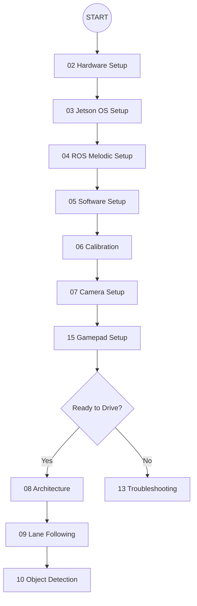

# Getting Started with JetRacer-ROS

This guide will help you get started with the Waveshare JetRacer ROS AI Kit on the NVIDIA Jetson Nano Developer Kit B01 (4GB) running JetPack 4.4 and ROS 1 Melodic.

## Pre-requisites

* Waveshare JetRacer ROS AI Kit (assembled)
* NVIDIA Jetson Nano B01 (4GB) with JetPack 4.4 installed (Ubuntu 18.04 Bionic)
* Monitor, keyboard, mouse (for initial setup)
* PC for remote control (optional but recommended)

## Setup Roadmap



## Setup Steps

Please refer to the detailed guides in the `docs` directory:

1. **[02 Hardware Setup](02_hardware_setup.md)**: Details on physical connections and preparation.
2. **[05 Software Setup](05_software_setup.md)**: Instructions for installing ROS Melodic, dependencies, and building this workspace.
3. **[14 References](14_references.md)**: Original tutorial links and documentation.

## Running the Robot

Once your software is built and sourced (`source devel/setup.bash`), you can launch the core functionality.

Launch the main JetRacer nodes:
```bash
roslaunch jetracer jetracer.launch
```

For teleoperation using an Xbox controller or other gamepad, please see the **[15 Gamepad Setup Guide](15_gamepad_setup.md)**.

For manual control using launch files, see the specific scripts in the `jetracer_ros/launch/` directory.

> [!NOTE]
> Ensure your Jetson Nano is powered sufficiently to avoid sudden shutdowns during heavy motor or GPU load.

## Help & Troubleshooting

If you encounter issues, refer to the **[13 Troubleshooting Guide](13_troubleshooting.md)** or the **[14 References](14_references.md)** for links to the Cytron support forum.
