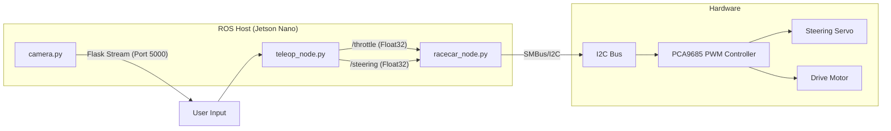
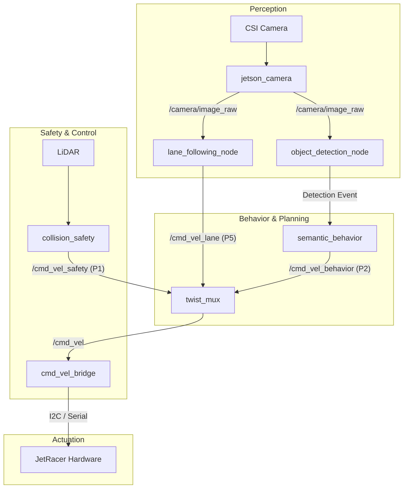

# JetRacer ROS Architecture

This document describes the software architecture for the JetRacer ROS AI Kit. It covers the difference between the **currently implemented** educational setup and the **proposed expert architecture** for autonomous driving.

> [!WARNING]  
> **Dual Hardware Architectures Detected**  
> The repository currently contains two conflicting hardware interfaces:
> 1. **Direct I2C Python Interface (`racecar.py`)**: Communicates directly with the PCA9685 via the `jetracer` Python library. Subscribes to raw Float32 `/throttle` & `/steering` topics.
> 2. **Serial MCU C++ Bridge (`jetracer.cpp`)**: Subscribes to standard `geometry_msgs/Twist` (`/cmd_vel`) and communicates with a custom MCU over `/dev/ttyACM0`. Outputs Odometry and IMU.
> 
> **Operational Risk**: If your board uses the standard Waveshare configuration (I2C only), launching `jetracer.launch` will fail instantly as it expects the `/dev/ttyACM0` serial MCU. You must use `racecar.py` instead.

## Currently Implemented Architecture

The current repository represents a simplified educational implementation where scripts handle both input and actuation.

* **`racecar_node.py`** (I2C):
  * Subscribes to `std_msgs/Float32` topics: `/throttle`, `/steering`.
  * Directly instantiates the `NvidiaRacecar` library to send I2C commands.
* **`jetracer.cpp`** (Serial):
  * Subscribes to `geometry_msgs/Twist` topics: `/cmd_vel`.
  * Communicates via Serial (`/dev/ttyACM0`) to set velocity and retrieve odometry (`/odom`) and IMU (`/imu`).
* **`teleop_gamepad_node.py`** / **`teleop_node.py`**:
  * Reads raw user input from the keyboard or joystick (via `pygame` / `getkey`).
  * Publishes directly to `/throttle` and `/steering`.
* **`camera.py`** (in `scripts/`): 
  * Not a ROS Node! Runs a Flask web server on port 5000 to stream GStreamer OpenCV frames. Does NOT publish to `/camera/image_raw`.

## Proposed Autonomous Driving Architecture (TODO)

To fully support advanced autonomy, safety, and priority arbitration, the following architecture is **proposed as future work**:

### Inputs
- **Camera**: `/camera/image_raw`, `/camera/camera_info` (Needs a real ROS CSI camera node like `jetson_camera`).
- **LiDAR** (If equipped): `/scan`
- **Joystick**: `/joy` (using `sensor_msgs/Joy` instead of `pygame`)

### Perception
- **`lane_following_node`** (Implemented)
  - Subscribes: `/camera/image_raw`
  - Publishes: `/cmd_vel_lane` (geometry_msgs/Twist), `/lane/waypoints`, `/lane/debug_image`
- **`object_detection_node`** (TODO)

### Behavior and Safety
- **`semantic_behavior_node`** (TODO)
- **`collision_safety_node`** (TODO)

### Command Arbitration
- **`twist_mux`** (TODO): Arbitrates velocity commands based on priority.

### Control and Actuation
- **`cmd_vel_to_jetracer_control_node`** (TODO):
  - Will safely replace the I2C `/throttle` logic with a unified `/cmd_vel` Twist subscription to unify both hardware paths.
