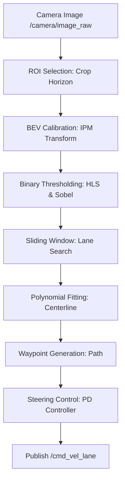

# Lane Following

This document describes the computer vision lane following pipeline implemented in `lane_following_node.py`. It is a standard ROS 1 Melodic catkin-compatible node that uses OpenCV without requiring deep learning or YOLO.

## Pipeline Overview

1. **Camera Input**: Subscribes to `/camera/image_raw`.
2. **ROI Selection**: Crops the top half of the image (sky/horizon) to focus only on the ground based on `roi_y_min` and `roi_y_max`.
3. **BEV Calibration**: Applies an Inverse Perspective Mapping (Bird's-Eye View) to transform the camera perspective into a top-down view.
4. **Binary Thresholding**: Converts the image using HLS color space saturation/lightness and Sobel edge gradients to isolate white/yellow lane markings.
5. **Sliding-Window Lane Search**: Computes a histogram to find lane bases and slides windows upwards to capture lane pixels.
6. **Lane Centerline Estimation**: Fits a 2nd-order polynomial. If only one lane is visible, it infers the centerline using the configured `lane_width_m`.
7. **Waypoint Generation**: Plots `N` future points along the centerline and transforms them to the robot's coordinate frame, publishing to `/lane/waypoints` using `nav_msgs/Path`.
8. **Steering Command Generation**: Selects a lookahead waypoint, calculates lateral error, and computes a PD-controlled steering command published to `/cmd_vel_lane`.
9. **Debug Topics**: Publishes a BEV binary mask to `/lane/bev_image` and a fully annotated overlay to `/lane/debug_image`.

## Calibration Procedure

> [!WARNING]
> The default values in `config/lane_following.yaml` are **placeholders**. They MUST be calibrated on the physical JetRacer in its actual operating environment.

1. **BEV Calibration**: The `src_points` must map to a physical rectangle on the ground in the camera's view. If the camera angle changes, BEV will fail.
2. **Thresholding**: Lighting drastically affects HSV/HLS thresholds. You may need to tune `hls_s_min` and `hls_l_min` depending on shadows and glare.
3. **Scale**: The `xm_per_pix` and `ym_per_pix` must be measured. Place an object of known size in the BEV frame and measure the pixel width.

## Known Limitations & Safety Behavior

* **Single Lane Fallback**: If the camera view does not include clear lane markings for both sides, the node relies heavily on the `lane_width_m` approximation.
* **Failsafe**: If no image is received, BEV fails, lane confidence drops, or `/safety/emergency_stop` is triggered, the node will output a zero-velocity Twist command.
* **Command Arbitration**: This node **does not** command the serial driver directly. It publishes `/cmd_vel_lane` which must be arbitrated by `twist_mux` (Priority 5, lowest).

Do not claim autonomous driving performance until these parameters are validated on the actual JetRacer track.
