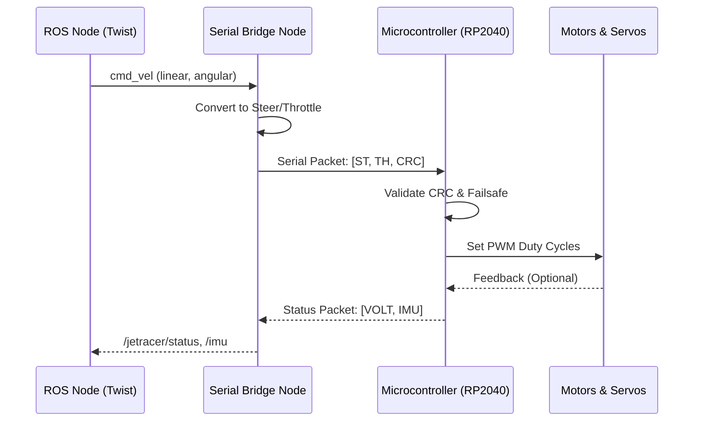

# Serial Protocol (Proposed)

> [!NOTE]
> This applies to the proposed architecture where motor commands are relayed to a dedicated MCU via serial, or to the existing Waveshare I2C interface.

## Current I2C Implementation
The existing `racecar.py` node bypasses serial and communicates directly with the PCA9685 PWM controller over the Jetson Nano's I2C bus using the `NvidiaRacecar` Python library.

## Proposed Serial Bridge
If an RP2040 or custom MCU is integrated in the future:

- **Node**: `jetracer_serial_node.py`
- **Subscribes**: `/jetracer/control` (Custom Message: steering, throttle)
- **Publishes**: `/jetracer/status` (Battery voltage, MCU state)
- **Configuration**: Defined in `config/serial.yaml` (`/dev/ttyACM0`, 115200 baud).

If implemented, the node must include a serial failure safe stop: if the serial connection drops, the MCU must automatically cut motor power.
